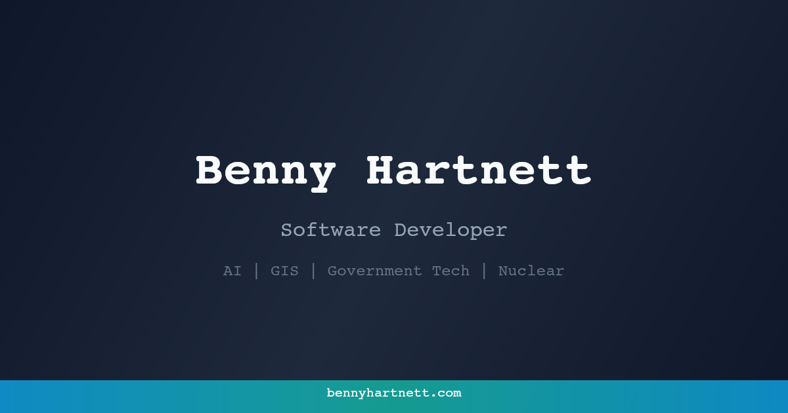

# bennyhartnett.com

[](https://bennyhartnett.com)
[](https://github.com/bennyhartnett/bennyhartnett.com/actions/workflows/test.yml)
[](https://github.com/bennyhartnett/bennyhartnett.com/actions/workflows/quality-checks.yml)
[](https://github.com/bennyhartnett/bennyhartnett.com/actions/workflows/quality-checks.yml)
[](https://github.com/bennyhartnett/bennyhartnett.com/actions/workflows/quality-checks.yml)
[](https://github.com/bennyhartnett/bennyhartnett.com/actions/workflows/gh-pages.yml)
[](#license)

Personal portfolio site with subdomain-based routing, a PWA shell, and an isolated uranium enrichment calculator.

## Live Website

- **Production:** [https://bennyhartnett.com](https://bennyhartnett.com)
- **Example subdomains:** [https://contact.bennyhartnett.com](https://contact.bennyhartnett.com), [https://nuclear.bennyhartnett.com](https://nuclear.bennyhartnett.com)

## Preview



## Architecture

- **Frontend**: Vanilla HTML/CSS/JS (ES6 modules, no bundler). Libraries load from CDNs.
- **Routing**: Hybrid system — Cloudflare Workers handle edge routing, client-side SPA loads page fragments from `pages/`.
- **Hosting**: GitHub Pages + Cloudflare Workers.
- **PWA**: Service worker (`sw.js`) with versioned cache for offline support.

Each section of the site lives on its own subdomain (e.g., `contact.bennyhartnett.com`, `nuclear.bennyhartnett.com`). Path-based URLs (`bennyhartnett.com/contact`) redirect to the subdomain equivalent.

## Quick Start

```bash
npm ci                          # Install dev dependencies (vitest)
python3 -m http.server          # Serve locally at http://localhost:8000
npm test                        # Run unit tests
```

No build step required.

## Key Files

| Path | Purpose |
|------|---------|
| `index.html` | SPA entry point — detects subdomain, loads page fragments |
| `workers/router.js` | Cloudflare Worker for edge routing and subdomain redirects |
| `sw.js` | Service worker with versioned cache (`CACHE_VERSION`) |
| `pages/*.html` | Content fragments loaded by the SPA (18 pages) |
| `nuclear/` | Standalone uranium enrichment calculator (separate app) |
| `js/` | SPA modules: routing, meta tags, analytics, 3D background, cursor |
| `css/` | Stylesheets: main, components, animations, scrollbar |
| `config/` | PWA manifest, `llms.txt`, `humans.txt` |

## Testing

```bash
npm test              # Run tests once (vitest)
npm run test:watch    # Watch mode
npm run test:coverage # With coverage
npm run check:sw-guardrails # Service worker cache guardrails (CI helper)
npm run check:pr-smoke      # Broken-link and static asset smoke checks
```

### Test Suites

- `nuclear/nuclear-math.test.js` — Uranium enrichment math, mode consistency, and edge cases.
- `workers/router.test.js` — Cloudflare worker routing and redirect behavior.
- `sw.test.js` — Service worker lifecycle + fetch strategy behavior.
- `js/spa-router.test.js` — SPA route selection and link-handling redirects.
- `scripts/ci/check-sw-guardrails.test.js` — Cache-version/page-asset guardrail logic.
- `scripts/ci/pr-smoke-checks.test.js` — Broken link/static asset smoke-check logic.

### Current Local Status (2026-04-22)

| Command | Status | Notes |
|---|---|---|
| `npm test` | ✅ Pass | All suites passing locally. |
| `npm run check:sw-guardrails` | ✅ Pass* | Passes when no `BASE_SHA`/`HEAD_SHA` are provided (expected local behavior). |
| `npm run check:pr-smoke` | ✅ Pass | Internal asset/page checks pass. |
| `npm run test:coverage` | ❌ Fail | Missing dev dependency `@vitest/coverage-v8`. |

CI runs on every push/PR to `main` via `.github/workflows/test.yml` and `.github/workflows/quality-checks.yml`.

## Deployment

- **GitHub Pages**: Auto-deploys on push to `main` via `.github/workflows/gh-pages.yml`.
- **Cloudflare Worker**: Auto-deploys when `workers/` or `wrangler.toml` change via `.github/workflows/deploy-worker.yml`.

## AI Agent Support

This repo is configured for AI coding agents:

- `CLAUDE.md` — Development instructions, architecture docs, and guardrails for Claude Code
- `AGENTS.md` — Cross-tool agent instructions (Cursor, Copilot, Windsurf, etc.)
- `.claude/settings.json` — Session-start hooks for Claude Code (auto-installs deps)
- `.editorconfig` — Code style enforcement for all editors and agents
- `config/llms.txt` / `config/llms-full.txt` — Structured content for LLM consumption
- `.well-known/ai-plugin.json` — AI plugin metadata

## License

This repository does not include a license file. Contact me@bennyhartnett.com for reuse inquiries.
